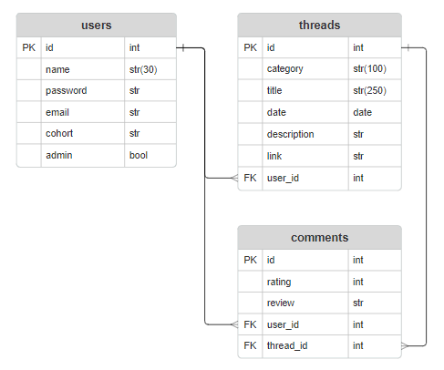
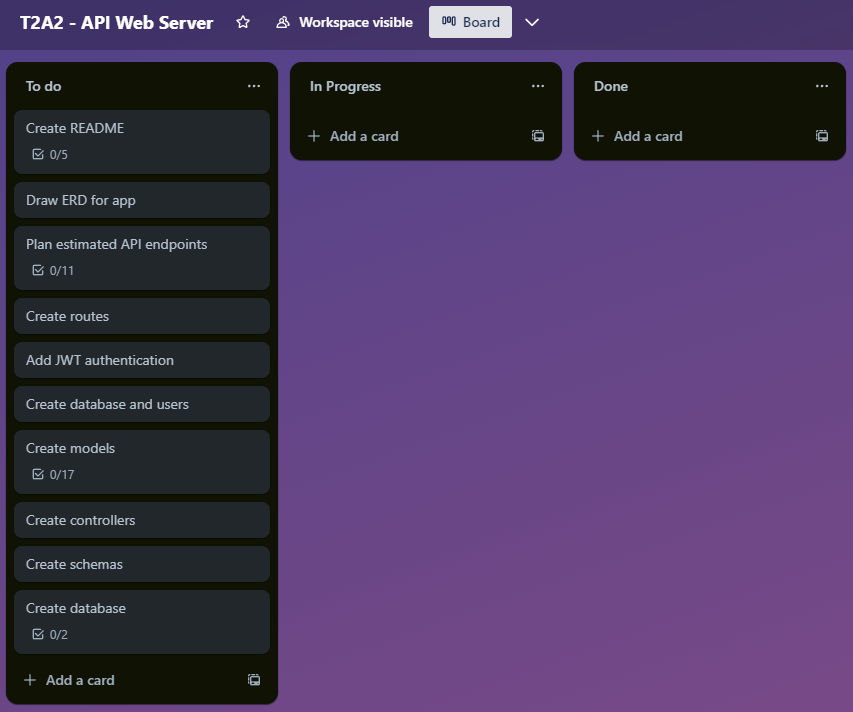
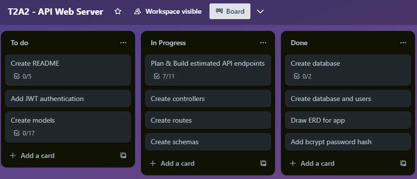
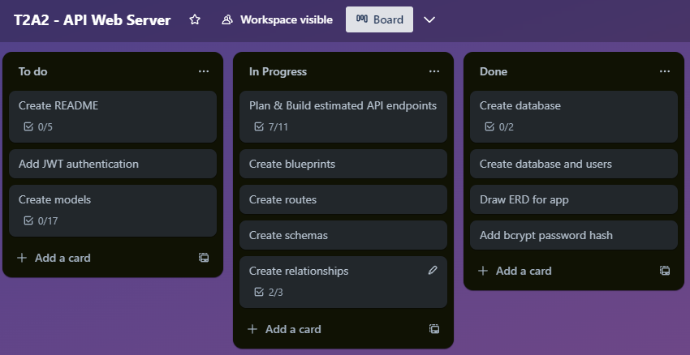
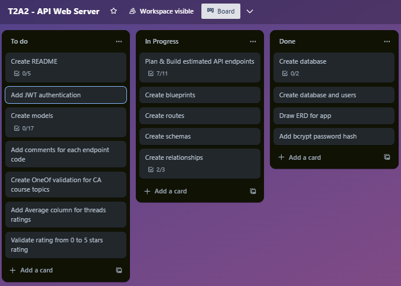
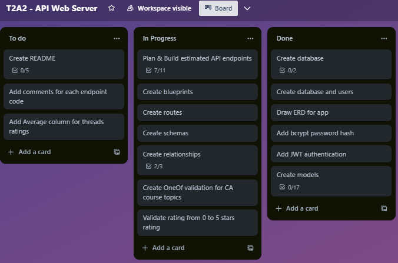
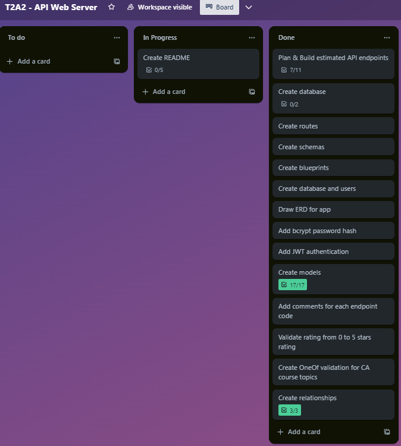

# T2A2 - API Web Server Project - CramHub
Hello! Thanks for visiting the CramHub repository!

CramHub is a web server and API project that allows anyone studying coding concepts to submit any content they've found online and letting other students add a rating and review with the aim that meaningful and helpful content that is highly rated by peers can be easily found.

---
## Directory
R0 - [Install guide (WSL)](#r0---install-guide-wsl)

R1 - [Problem I'm trying to solve](#r1---problem-im-trying-to-solve)

R2 - [Why does it need solving?](#r2---why-does-it-need-solving)

R3 - [Why did I choose this database system (and comparison to others)?](#r3---why-did-i-choose-this-database-system-and-comparison-to-others)

R4 - [Key functionalities and benefits of an ORM](#r4---key-functionalities-and-benefits-of-an-orm)

R5 - [API Endpoints](#r5---api-endpoints)

R6 - [ERD](#r6---erd)

R7 - [Third party services](#r7---third-party-services)

R8 - [Project models relationships](#r8---project-models-relationships)

R9 - [Database relations](#r9---database-relations)

R10 - [Project Management](#r10---project-management)

## R0 - Install guide (WSL)
#### Create Virtual Environment
- Open a WSL terminal and create a virtual environment
- `python3 -m venv .venv`
- Activate the virtual environment
- `source .venv/bin/activate`
- Open your IDE
- `code .`
- Install the dependencies
- `pip install -r requirements.txt`

#### Create a PostgreSQL database and admin user
- Open a WSL terminal and open PostgreSQL 
- `sudo -u postgres psql`
- Create a database
- `create database cramhub_db;`
- Create a database admin user with password (example credentials below)
- `create user cramhub_dev with password 'cramhub';`
- Grant all privileges to admin user
- `grant all privileges on database cramhub_db to cramhub_dev;`
- Grant all permissions on database schemas to admin user
- `grant all on schema public to cramhub_dev;`

#### Create tables, seed database and run Flask application
- Open a WSL terminal (exit out of PostgreSQL if still open)
- Create the tables
- `flask db create`
- Seed the tables with data
- `flask db seed`
- Run the Flask app
- `flask run`

#### Application Environment files
- Create a new `.flaskenv` file and change the included code in the `.flaskenv_sample` file to suit your needs
- Create a new `.env` file and change the included code in the `.env_sample` file to suit your needs
---

## R1 - Problem I'm trying to solve
Have you ever experienced the building internal dread of sitting in class thinking *'Gadzooks! I don't understand a thing about this topic'*? Yep, I've been there, *we've* been there.

After taking a few moments to pull yourself together while trying to hide your tears did you ever stare blankly out the classroom window (or at the Windows XP flowing meadows wallpaper) and think *'You know what would be awesome? If I could crowdsource my studies so I'm not wasting precious **Risk of Rain 2** time by trying to find something good to study!'*?

The CramHub project aims to crowdsource learning materials from students alike that were particularly helpful in helping them understand a particular concept -- students can submit a thread with a description and a link to the resource to the CramHub platform. There is a peer-review angle that allows other students to give the material a go and give a rating and review with the aim that high quality content will be higher ranked allowing other students to quickly view the ratings and save time when trying to pick something to study.

For this particular application, my usecase has been for the CoderAcademy course syllabus thus far (and the allowable categories can be extended quite easily) for the benefit of the students undertaking this course. 

## R2 - Why does it need solving?
With the advent of the internet it's very easy to find information or materials with a few keystrokes and a mouse click allowing anyone to upskill if they put the time in; but alas, this is a double-edged sword. With heaping mounds of information comes a huge time investment trying to find material that fits the bill and not a word dump copied from StackOverflow for SEO optimisation. 

It's extremely time consuming to trawl through the huge mountain of guides, walkthroughs and YouTube videos to find something that is easily understandable with a clear and concise step-by-step approach.

The CramHub project aims to reduce this time investment that is required before any substantial learning can even begin.

## R3 - Why did I choose this database system (and comparison to others)? 
The database system I have chosen for this project is PostgreSQL. PostgreSQL is one of the more popular and well-regarded open-source databases and has a robust feature set including the ability for writing database functions using Python, which has been the language used for this project. Additionally, PostgreSQL has built-in cascading functions which has been especially useful for this project which deletes all comments that are attached to a thread when a thread is deleted.

PostgreSQL also supports a long list of data types, full-text search and can handle large amounts of data which will be useful if this project needs to be further extended in the future.

Additionally, PostgreSQL has authentication, access control and privilege management systems which are vital in assigning authorisation functionality to database access which is important to any project that has multiple users that require different levels of authorisation.

Some areas where PostgreSQL falls short of the competition include:
- PostgreSQL may have slightly lower write performance compared to other databases that were designed for high write performance such as MongoDB
- PostgreSQL may have a steeper learning curve compared to other databases such as MySQL which is another popular open-source database with a large community that is known to be easy to use
- PostgreSQL may consume more resources compared to other databases which should be considered in a resource-constrained environment, SQLite may be better suited if this is a consideration

## R4 - Key functionalities and benefits of an ORM
Object relational mapping (ORM) is a technique that connects object oriented programming (OOP) to relational databases and can help to simplify the interaction between relational databases and different OOP languages, such as Python.

Some key functionalities of ORMs include:
- Object mapping to database tables: meaning the ORM will establish a bridge between object classes and database tables 
- CRUD operations: ORMs can provide methods and functions to Create, Read, Update and Delete objects within a database
- Query language: allows developers to query a database using high level languages, such as Python in this project, to retrieve data rather than having to write pure SQL statements
- Data validation: ORMs can enforce data validation rules defined in the object classes which ensures data consistency and integrity
- Relationship mapping: ORMs manage the object-table relationships including one-to-one, one-to-many and many-to-many relationships

Some key benefits of ORMs include:
- Abstracts away database complexity: meaning that developers can focus on the application logic instead of having to spend time writing SQL queries
- Platform agnostic: most ORMs support different database platforms allowing developers to switch databases without having to overhaul all their code
- Enhanced security: ORMs often have built-in protection against SQL injection attacks which can help to mitigate security risks

## R5 - API Endpoints
- Users endpoints
    - [Register new user](#1-register-new-user)
    - [Login as existing user](#2-login-as-existing-user)
    - [Get all users](#3-get-all-users)
    - [Get all threads by all users](#4-get-all-threads-by-all-users)
    - [Get all threads by a single user (by user_id)](#5-get-all-threads-by-single-user-by-user_id)
    - [Get all comments by all users](#6-get-all-comments-by-all-users)

- Threads endpoints
    - [Get all threads](#7-get-all-comments-by-all-users)
    - [Get a single thread (by thread_id)](#8-get-a-single-thread-by-thread_id)
    - [Get all threads (by category)](#9-get-all-threads-by-category)
    - [Create new thread](#10-create-new-thread)
    - [Update existing thread (by thread_id)](#11-updating-existing-thread-by-thread_id)
    - [Delete existing thread (by thread_id)](#12-delete-existing-thread-by-thread_id)

- Comments endpoints 
    - [Get all comments](#13-get-all-comments)
    - [Create new comment on thread (by thread_id)](#14-create-new-comment-on-thread-by-thread_id)
    - [Update existing comment (by comment_id)](#15-update-existing-comment-by-comment_id)
    - [Delete existing comment (by comment_id)](#16-delete-existing-comment-by-comment_id)

### Users endpoints
#### 1. Register new user
Register a new user which will be added to the database. An access token will be presented to the user upon successful registration
- Endpoint: `/users/register`
- HTTP verb: `POST`
- Required data:
  - `name`
  - `password`
  - `email`
  - `cohort`
- Expected response:
  - `201 CREATED`
  - Return all data excluding: `password`, `admin`
  - Message: `User {name} has been registered! 🙂`
  - `Access token` (with 6 hour expiry)
- Authentication method: None

---

#### 2. Login as existing user
Log in as existing user. An access token will be presented to the user upon successful login
- Endpoint: `/users/login`
- HTTP verb: `POST`
- Required data:
  - `email`
  - `password`
- Expected response:
  - `200 OK`
  - Return `user` and `token`
  - Message: `Successfully logged in! 🙂`
- Authentication method: If the user exists, the submitted password will be hashed (via Bcrypt) and compared to the hashed password in the database

---

#### 3. Get all users
Retrieves all users in the database
- Endpoint: `/users`
- HTTP verb: `GET`
- Required data: `None`
- Expected response:
  - `200 OK`
  - Return list of users excluding: `password`, `admin`, `threads`, `comments`
- Authentication method: `None`

---

#### 4. Get all threads by all users
Retrieves all threads grouped by user 
- Endpoint: `/users/threads`
- HTTP verb: `GET`
- Required data: `None`
- Expected response:
  - `200 OK`
  - Return list of users excluding: `id`, `password`, `admin`, `comments`
- Authentication method: `None`

---

#### 5. Get all threads by single user (by user_id)
Retrieves all threads submitted by a single user (by user_id)
- Endpoint: `/users/<int:user_id>/threads`
- HTTP verb: `GET`
- Required data: `None`
- Expected response:
  - `200 OK`
  - Return list of threads that belong to a single user excluding: `comments`
- Authentication method: `None`

---

#### 6. Get all comments by all users
Retrieves all comments grouped by user
- Endpoint: `/users/comments`
- HTTP verb: `GET`
- Required data: `None`
- Expected response:
  - `200 OK`
  - Return list of comments by all users
- Authentication method: `None`

---

### Threads endpoints
#### 7. Get all threads
Retrieves all threads in the database
- Endpoint: `/threads`
- HTTP verb: `GET`
- Required data: `None`
- Expected response:
  - `200 OK`
  - Return list of threads excluding: `comments`
- Authentication method: `None`

---

#### 8. Get a single thread (by thread_id)
Retrieves a single thread (by thread_id)
- Endpoint: `/threads/<int:thread_id>`
- HTTP verb: `GET`
- Required data: `None`
- Expected response:
  - `200 OK`
  - Return single thread
- Authentication method: `None`

---

#### 9. Get all threads (by category)
Retrieves all threads that match the category given in the URL
- Endpoint: `/threads/<str:category>`
- HTTP verb: `GET`
- Required data: `None`
- Expected response:
  - `200 OK`
  - Return all threads that match the requested category
- Authentication method: `None`

---

#### 10. Create new thread
Create a new thread which will be added to the database
- Endpoint: `/threads`
- HTTP verb: `POST`
- Required data:
  - `category` - must be one of the following categories: HTML, CSS, Python, SQL, Flask
  - `title`
  - `description`
  - `link`
- Expected resonse:
  - `201 CREATED`
  - Return thread data excluding: `user`, `comments`
  - Message: `Thread submitted! 🙂`
- Authentication: Current JWT

---

#### 11. Updating existing thread (by thread_id)
Update an existing thread in the database (by thread_id)
- Endpoint: `/threads/<int:thread_id>`
- HTTP verb: `PUT`, `PATCH`
- Required data:
  - `category` - must be one of: HTML, CSS, Python, SQL, Flask
  - `title`
  - `description`
  - `link`
- Expected resonse:
  - `200 OK`
  - Return updated thread data excluding: `date`, `user`, `comments`
  - Message: `Thread {title} has been updated! 🙂`
- Authentication: Current JWT, JWT user id must match user id that created original thread

---

#### 12. Delete existing thread (by thread_id)
Delete an existing thread from the database (by thread_id)
- Endpoint: `/threads/<int:thread_id>`
- HTTP verb: `DELETE`
- Required data:`None`
- Expected resonse:
  - `200 OK`
  - Message: `Thread {title} deleted! 🙂`
- Authentication: Current JWT, JWT user id must match user id that created original thread

---

### Comments endpoints

#### 13. Get all comments
Retrieves all comments in the database
- Endpoint: `/comments`
- HTTP verb: `GET`
- Required data: `None`
- Expected response:
  - `200 OK`
  - Return list of comments 
- Authentication method: `None`

---

#### 14. Create new comment on thread (by thread_id)
Create a new comment on a thread (by thread_id)
- Endpoint: `/threads/<int:thread_id>/comments`
- HTTP verb: `POST`
- Required data:
  - `rating` - must be integer and one of: 1, 2, 3, 4 or 5
  - `review`
- Expected resonse:
  - `201 CREATED`
  - Return comment data
  - Message: `Comment submitted! 🙂`
- Authentication: Current JWT

---

#### 15. Update existing comment (by comment_id)
Update an existing comment in the database (by comment_id)
- Endpoint: `/comments/<int:comment_id>`
- HTTP verb: `PUT`, `PATCH`
- Required data:
  - `rating`
  - `review`
- Expected resonse:
  - `200 OK`
  - Return updated thread data excluding: `user`
  - Message: `Comment with ID: '{comment_id}' has been updated! 🙂`
- Authentication: Current JWT, JWT user id must match user id that created original comment

---

#### 16. Delete existing comment (by comment_id)
Delete an existing comment in the database (by comment_id)
- Endpoint: `/comments/<int:comment_id>`
- HTTP verb: `DELETE`
- Required data:`None`
- Expected resonse:
  - `200 OK`
  - Message: `Comment with ID: '{comment_id}' deleted! 🙂`
- Authentication: Current JWT, JWT user id must match user id that created original comment

---

## R6 - ERD

## R7 - Third party services
#### Flask
Flask is a web micro-framework used to develop web applications using Python with a small and easy-to-extend core. Flask is based on the Werkzeug WSGI toolkit and the Jinja2 template engine and allows apps to use requests, response objects and utility functions.

#### SQLAlchemy
SQLAlchemy is a toolkit that allows developers to efficiently access a relational database, currently supporting a number of database engines include SQLite, MySQL and PostgreSQL. SQLAlchemy also provides an object relational mapper (ORM) allowing developers to query and handle the data from the database.

#### PostgreSQL
PostgreSQL is an open-source object-relational database management system that supports a large part of the SQL standard as well as JSON querying. For more information about PostgreSQL and why this was chosen, please see R4.

#### marshmallow
Marshmallow is an integration layer for Flask where marshmallow is an object serialisation/deserialisation library which also supports integration with SQLAlchemy and a range of data validation functions. In this project marshmallow has been used to validate data configuration according to pre-defined schemas. Some examples of data validation in this project include data input needing to belong to a list of categories (OneOf function), requiring passwords to be over 6 characters long (Length function) and ensuring that submitted values are not blank (Length function)

#### Psycopg2
Psycopg2 is the most popular PostgreSQL database adapter for Python allowing developers to perform the full range of SQL operations against PostgreSQL databases. In this project the Psycopg2 connector can be found in the `.flaskenv_sample` file. 

#### Bcrypt
Bcrypt is a cryptographic hash function designed for one-way password hashing and transforms a user's password into a fixed-length character hash. In this project Bcrypt is used to hash passwords upon registration and login routes; for the login route the hashed input password is compared with the hashed password stored in the database.

#### JWT Extended
JWT Extended is a package that adds support for using JSON Web Tokens to Flask for protecting routes. In this project the `jwt_required` and `get_jwt_identity` functions have been used on some routes ensuring that a user has a valid JWT is present as their user ID from the JWT is needed to link a thread or comment to their user account and to ensure they have authorisation to update or delete their own content from the database. 

## R8 - Project models relationships
#### User model
- The User model represents a user in this project which can be summarised with a user story: *"As a user I want to be able to submit threads and add my ratings and reviews to threads so that I can share my input with others."*

The user model has a one-to-many relationship with threads as well as a one-to-many relationship with comments where a single user can create multiple threads and multiple comments. This is represented as the user's `id` defined as a foreign key in both the threads and comments models using the `db.relationship` function and threads and comments both back populate to the user model.

The user model uses the cascade function for both threads and comments meaning that if a user account is deleted (not implemented in this project), their threads and comments will also be deleted from the system.

The user model also has nested threads and comments fields.

#### Thread model
- The Thread model represents the threads that are submitted to the database by a user which can be summarised with a user story: *"As a user, I want to be able to submit threads that will also show ratings and reviews from other users, so that I can share my input with others".*

The thread model has a many-to-one relationship with users where a user can submit to multiple threads; the user `id` is defined as the foreign key in the thread model and back populates to the user model. 

The thread model has a one-to-many relationship with comments where a single thread can have multiple comments.

The thread model uses the cascade function for comments meaning that if a user deletes their thread, all comments attached to that thread will also be deleted from the system.

The thread model also has nested user and comments fields.

#### Comment model
- The comments model represents the ratings and reviews that are submitted to a thread by a user which can be summarised with the user story: *"As a user, I want to be able to add comments to threads, so that I can share my input with others."*

The comments model has a many-to-one relationship with threads, as one comment can only belong to
thread, but a thread can have many comments; the thread `id` is used as a foreign key in the comments table and back populates to the threads and users models.

The comments model has a many-to-one relationship with users, as a comment can only belong to one user, but a user can have many comments; the user `id` is used as a foreign key in the comments table.

The comment model also has nested user and thread fields.

## R9 - Database relations
#### User one-to-many relationship with threads and comments
The user model creates a one-to-many relationship with both the threads and comments model by the `db.relationship` function. The threads and comments models are linked back to the user model by the `back_populates` function. Both threads and comments relationships that belong to a user will be deleted if a user account is deleted by using the `cascade="all, delete"` function.

#### Threads many-to-one relationship with users
The threads model creates a many-to-one relationship with the users model by the `db.relationship` function and establishes a two way relationship with the `back_populates` function. The `user_id` is defined as the foreign key in the threads table which is the `id` from the users table.

#### Threads one-to-many relationship with comments
The threads model creates a one-to-many relationship with the comments model by the `db.relationship` function and establishes a two way relationship with the `back_populates` function. All comments that belong to a thread will be deleted if a thread is deleted by using the `cascade="all, delete"` function.

#### Comments many-to-one relationship with users and threads
The comments model creates a many-to-one relationship with the users and threads models by the `db.relationship` function and establishes a two way relationship with the `back_populates` function. 

The `user_id` which is the id from the users table and the `thread_id` which is the id from the threads table are defined as the foreign keys in the comments table.

## R10 - Project Management
The project management tool used for this project was a Trello kanban board and created 'To do', 'In progress' and 'Done' categories.

I first laid out my main requirements for this project so I would have a better view of the project as a whole and to assist with time management. The first few tasks I undertook were planning tasks to reduce the incidence of surprises later down the track:
- Draw ERD for app
- Plan estimated API endpoints (11)

The first part after planning was creating the actual database, so these tasks were completed next:
- Create database
- Create users

The part following was creating the blueprints, models and schemas so that I could retrieve or accept data via an API request. After these were done the routes could start being worked on.

The final parts of creating this app was adding the relationships between the models and adding authentication by way of the JWT extended library.

